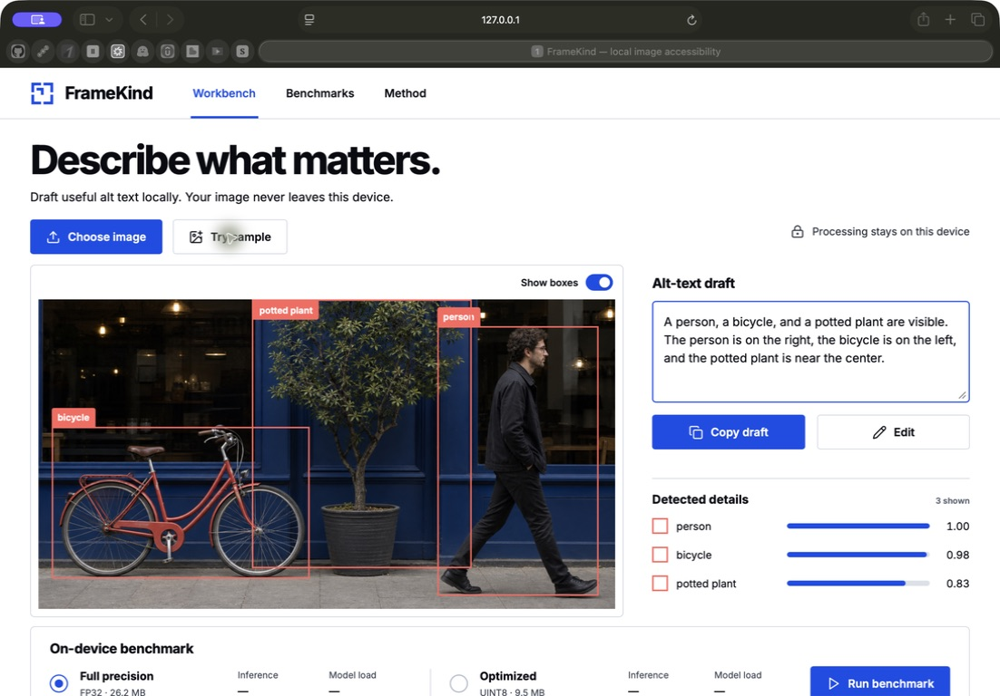
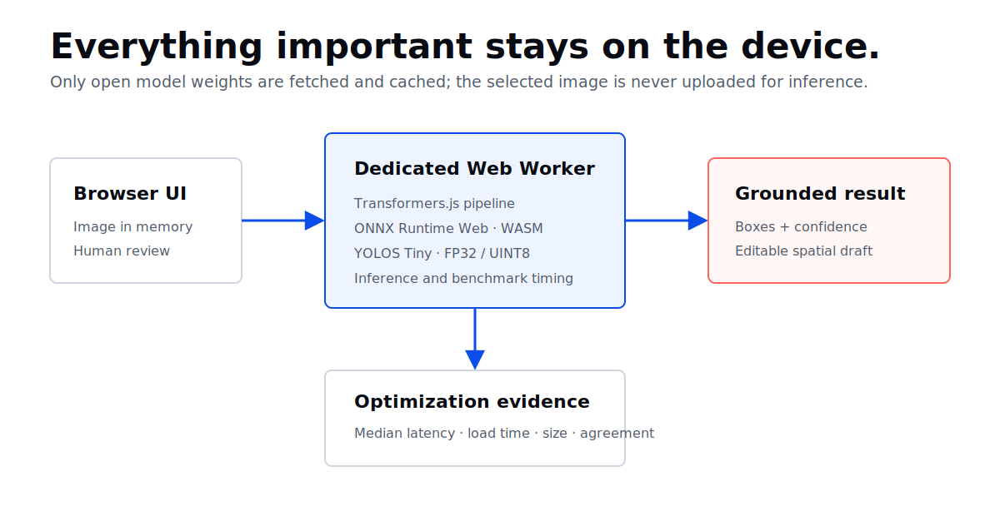

# FrameKind

Private alt-text drafts, powered on your device.

[**Open the live demo**](https://himanshu748.github.io/framekind/) · [Arm challenge](https://arm-ai-optimization-challenge.devpost.com/) · [Benchmark evidence](submission-assets/benchmark-m4-safari.json)



FrameKind is a privacy-first image accessibility tool. It runs YOLOS Tiny in the browser, overlays grounded detections, and turns them into an editable spatial alt-text draft. The image stays in browser memory: there is no image-upload API.

Built for the **Mobile AI** track of the [Arm Create AI Optimization Challenge](https://arm-ai-optimization-challenge.devpost.com/).

## Why it exists

Alt text improves access to visual content, but a hosted vision API can expose private, unpublished, or sensitive images. FrameKind explores a smaller and more transparent alternative: open-model inference on the user's device, with human review before anything is published.

## What it does

- Accepts PNG, JPEG, and WebP images up to 15 MB.
- Runs object detection locally with the UINT8 YOLOS Tiny ONNX model.
- Shows object boxes, labels, confidence scores, and coarse spatial position.
- Produces an editable draft and copies it in one click.
- Compares FP32 and UINT8 variants through a benchmark judges can rerun.
- Reports latency, weight size, and detection agreement together.

## Measured Arm64 result

One local Safari run on an Apple M4 used the bundled 1448×1086 sample, a 0.5 confidence threshold, one untimed warm-up, and five measured inferences per variant after pre-caching both weight files.

| Metric | FP32 | UINT8 |
| --- | ---: | ---: |
| Model weights | 26.2 MB | 9.51 MB |
| Model/session load | 501 ms | 2,634 ms |
| Median inference | 24,031 ms | 7,016 ms |

Observed on that run: **3.43× median speed ratio**, **63.7% smaller weights**, and **86% detection agreement**. These are a reproducible single-device observation, not a universal performance claim. The captured environment and result are in [`submission-assets/benchmark-m4-safari.json`](submission-assets/benchmark-m4-safari.json), with a [result screenshot](submission-assets/framekind-safari-benchmark.png).

Agreement requires an identical label and bounding-box intersection-over-union of at least 0.5, then uses a symmetric match score across both prediction sets.

## Architecture



React keeps interaction and review on the main thread. A dedicated Web Worker owns model loading, ONNX Runtime Web/WASM inference, model disposal, and benchmark timing. This keeps long-running full-precision inference away from UI work.

The draft generator is deliberately deterministic. It groups detections above the confidence threshold, adds quantities and left/center/right position, and avoids claims the detector did not establish.

## Run it

Requirements: a current browser with Web Workers and WebAssembly support, plus Node.js 20.19+ or 22.12+.

```bash
npm install
npm run dev
```

Then open the local URL printed by Vite. The first analysis downloads and caches open model weights. Images themselves are not sent to Hugging Face or another inference service.

Useful commands:

```bash
npm test
npm run build
npm run preview
```

## Benchmark method

1. Load and dispose each variant once so both weight files are in the browser cache.
2. Create a fresh FP32 session, run one untimed warm-up, then record five runs.
3. Dispose FP32 and repeat the same process for UINT8 against the same image.
4. Report the median and p95 internally, keep model/session load separate, and compare detection agreement.
5. Retain the optimized session for the normal product workflow.

The UI surfaces the median, session-load time, model size, and agreement. Timing uses `performance.now()` around inference calls inside the worker.

## Limits and responsible use

- YOLOS Tiny recognizes the COCO label set; it is not a general image-understanding system.
- The draft is a starting point, not authoritative alt text. Context and intent still require a person.
- Detection confidence and spatial heuristics can be wrong. Review every draft.
- The first visit needs network access to fetch model weights; later use benefits from the browser cache.
- Performance depends on hardware, browser, thermals, and current system load.

## Technology and attribution

- React, TypeScript, and Vite
- [Transformers.js](https://huggingface.co/docs/transformers.js/) and ONNX Runtime Web/WASM
- [`Xenova/yolos-tiny`](https://huggingface.co/Xenova/yolos-tiny), an ONNX-compatible conversion of YOLOS Tiny
- Lucide icons and Inter Variable

FrameKind source is MIT licensed. Third-party models, packages, fonts, and icons retain their own licenses.

## AI assistance disclosure

OpenAI Codex assisted with ideation, implementation, testing, design exploration, and documentation. YOLOS Tiny supplies object detection. The bundled sample image was generated for demonstration and testing. The entrant must review and approve the final project and contest submission.
