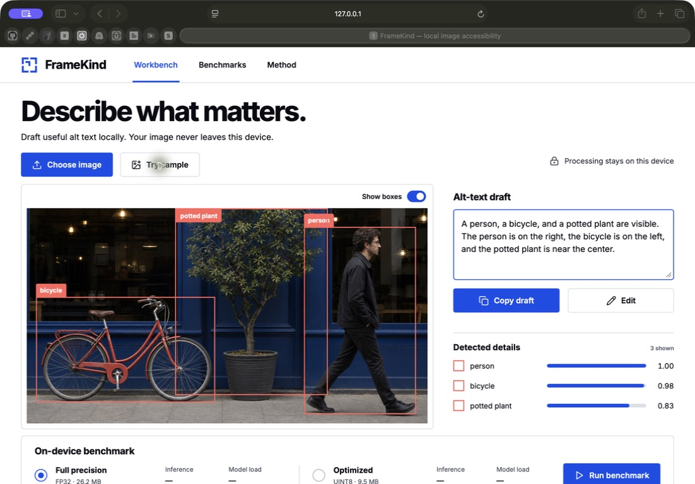
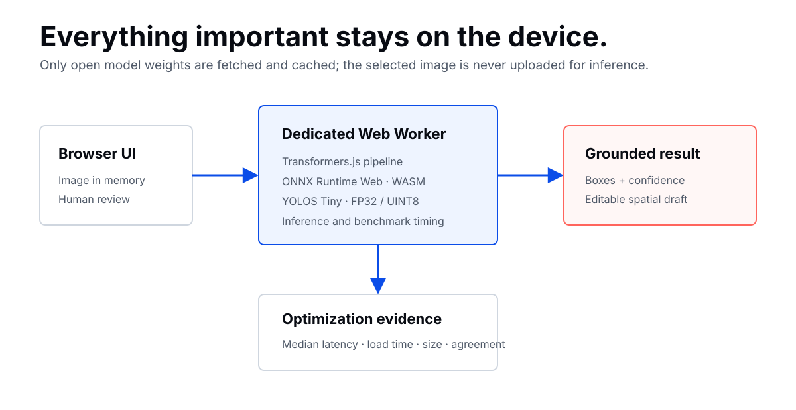

# FrameKind

Private alt-text drafts, powered on your device.

[**Open the live demo**](https://framekind-ai.netlify.app/) · [Arm challenge](https://arm-ai-optimization-challenge.devpost.com/) · [Why the Arm wins landed where they did](docs/arm-optimization.md) · [Sweep evidence](submission-assets/sweep-apple-silicon-interleaved.json)



FrameKind is a privacy-first image accessibility tool. It runs YOLOS Tiny in the browser, overlays grounded detections, and turns them into an editable spatial alt-text draft. The image stays in browser memory: there is no image-upload API.

Built for the **Mobile AI** track of the [Arm Create AI Optimization Challenge](https://arm-ai-optimization-challenge.devpost.com/), targeting Arm-powered laptops.

## The finding

The usual advice for shrinking a browser model is to quantize it. On an Arm64 laptop that advice does not survive contact with a benchmark, and FrameKind measures why in the app.

- **Quantization bought nothing on the CPU backend.** UINT8 weights are 64% smaller than FP32, and inference came out at 1.01× the reference. Not a regression, not a win, parity.
- **Quantization on WebGPU is actively harmful.** WebGPU UINT8 ran slower than WebGPU FP32 and scored **0% detection agreement**, meaning it did not find the reference objects at all. The smallest file was not merely the slowest configuration on the fastest backend, it was a broken one, and only the quality guardrail catches that.
- **The backend was the real lever.** The same FP32 graph moved to WebGPU ran 2.29× faster and reproduced the reference detections exactly.

The single largest win was not precision at all. Reducing the input resolution, which costs one property on the image processor, was worth 7.42×.

There is an Arm-specific reason for this, worked through in [docs/arm-optimization.md](docs/arm-optimization.md). In short: attention is 56% of this model's arithmetic at native resolution, so cutting tokens attacks a quadratic term, while quantization has no mechanism to pay off in a browser because WebAssembly's `simd128` has no 8-bit dot product or matrix-multiply instruction. The `SDOT` and `SMMLA` instructions that make INT8 fast on Arm, and that Arm exposes to native frameworks through KleidiAI, are not reachable from the wasm sandbox. That is why the quantized rows wander around parity instead of winning. The cost model behind the resolution argument ships as tested code in [`src/lib/cost.ts`](src/lib/cost.ts).

## Measured on Arm64

Apple Silicon, cross-origin isolated, 4 WASM threads, weights pre-cached, agreement scored against the full-precision WASM reference. Five interleaved rounds. Raw runs: [`submission-assets/sweep-apple-silicon-interleaved.json`](submission-assets/sweep-apple-silicon-interleaved.json).

| Configuration | Weights | Best | Median | p95 | Versus reference | Agreement |
| --- | ---: | ---: | ---: | ---: | ---: | ---: |
| WASM · FP32 (reference) | 25.01 MB | 6,676 ms | 7,214 ms | 7,747 ms | 1.00× | reference |
| WASM · UINT8 | 9.07 MB | 6,636 ms | 6,830 ms | 8,932 ms | 1.01× | 86% |
| WASM · UINT8 @384px | 9.07 MB | 2,517 ms | 2,658 ms | 3,278 ms | 2.65× | 67% |
| WASM · UINT8 @256px | 9.07 MB | 900 ms | 939 ms | 1,172 ms | 7.42× | 86% |
| WebGPU · FP32 | 25.01 MB | 2,919 ms | 3,076 ms | 3,808 ms | 2.29× | 100% |
| WebGPU · FP16 | 12.72 MB | 1,594 ms | 1,686 ms | 2,711 ms | 4.19× | 75% |
| WebGPU · UINT8 | 9.07 MB | 2,818 ms | 3,505 ms | 5,740 ms | 2.37× | 0% |

Ratios are computed on best-round times. Weight sizes are the bytes this device actually fetched, read back from the Cache API, not constants written into the source.

The absolute numbers are high because this machine was busy, and that is the point: the ratios still reproduce. Getting there took a methodology fix, described below.

## Why the benchmark is built the way it is

An earlier version of this project reported a 3.43× speedup from quantization, measured once. Rebuilding it as a matrix showed that number did not survive a different browser. Then the rebuilt benchmark turned out to be unreliable too. Run as blocks, all of config A then all of config B, the same comparison gave:

| Method | UINT8 versus FP32 on WASM |
| --- | ---: |
| Blocks, run 1 | 0.99× |
| Blocks, run 2 | 0.62× |
| Blocks, run 3 | 1.54× |
| **Interleaved, 5 rounds** | **1.01×** |

A laptop drifts under thermal and background load over the minutes a sweep takes, and a block layout charges all of that drift to whichever configuration happened to hold the slow window. Interleaving the rounds spreads it across every row, and ranking on each configuration's best round discards the contaminated samples, because background load only ever adds time. That is why the ratios above reproduce on a busy machine while the earlier block-structured numbers swung by a factor of two.

Detection agreement, by contrast, was identical in every sweep from the start, block or interleaved. The quality half of this instrument was always reliable, and the latency half had to be engineered into reliability.

This is one machine and one architecture. Run the sweep on your own Arm device, check the gap between best and p95 to see how quiet your machine was, and expect the winner to differ.

## How the default is chosen

FrameKind runs the fastest configuration that reproduces the reference detections exactly, which on a WebGPU-capable Arm device is WebGPU FP32. Every reduced-precision variant measured here loses agreement, so the default trades no quality for its 2.29×. Quantization is kept for the WASM fallback, where it is the only lever left and the download saving is real regardless of what latency does.

The status bar names the configuration actually in use.

## Architecture



React keeps interaction and review on the main thread. A dedicated Web Worker owns backend selection, model loading, ONNX Runtime Web inference, model disposal, and sweep timing.

The draft generator is deliberately deterministic. It groups detections above the confidence threshold, adds quantities and left/center/right position, and avoids claims the detector did not establish.

## Run it

Requirements: a current browser with Web Workers and WebAssembly, plus Node.js 20.19+ or 22.12+. WebGPU is used when the browser exposes it and is not required.

```bash
npm install
npm run dev
```

Then open the local URL printed by Vite. The first analysis downloads and caches open model weights. Images themselves are not sent to Hugging Face or another inference service.

Useful commands:

```bash
npm test
npm run build
npm run preview
```

## Sweep method

1. Detect the backends this browser exposes, and set WASM threads from `crossOriginIsolated` and core count.
2. Load every configuration, warm each one with an untimed run, and hold all sessions open.
3. Run five interleaved rounds, taking one timed run per configuration per round, so drift is shared rather than charged to whichever configuration held the slow window.
4. Score every configuration against the full-precision WASM reference: identical label plus bounding-box intersection-over-union of at least 0.5, then a symmetric match rate across both prediction sets.
5. Read each variant's weight size back from the browser cache.
6. Rank on each configuration's best round, report best, median and p95 together, and export every raw run as JSON.

Agreement is computed on the image currently loaded, across a handful of boxes, so it is a pass or fail signal rather than a precise ranking. A 0% row means a configuration is broken. The gap between 86% and 75% is within the noise of a four-object image.

## Limits and responsible use

- YOLOS Tiny recognizes the COCO label set; it is not a general image-understanding system.
- The draft is a starting point, not authoritative alt text. Context and intent still require a person.
- Detection confidence and spatial heuristics can be wrong. Review every draft.
- The first visit needs network access to fetch model weights; later use benefits from the browser cache.
- The ONNX Runtime WASM binary is a larger download than the model weights, so weight-size reductions do not shrink the first visit as much as the model table suggests.
- Performance depends on hardware, browser, thermals, and current system load.

## Validate it on Arm64

1. Run `uname -m` and confirm the output is `arm64`.
2. Run `npm install`, then `npm run dev`.
3. Open the Vite URL and wait until the bundled sample shows detection boxes and a draft.
4. Check the status bar to see which backend and precision were selected on your device.
5. Select **Run sweep** and leave the tab open until every configuration completes.
6. Select **Export JSON** to keep the raw runs from your own device.
7. Run `npm test` and `npm run build` to validate the selection logic, the agreement metric and the production bundle.

## Hosting note

The app needs `Cross-Origin-Opener-Policy` and `Cross-Origin-Embedder-Policy` to reach multi-threaded WASM. Netlify sends both. GitHub Pages cannot send either, so the Pages URL redirects to the Netlify host rather than serving a copy that silently falls back to a single thread.

## Technology and attribution

- React, TypeScript, and Vite
- [Transformers.js](https://huggingface.co/docs/transformers.js/) and ONNX Runtime Web, WebGPU and WASM backends
- [`Xenova/yolos-tiny`](https://huggingface.co/Xenova/yolos-tiny), an ONNX-compatible conversion of YOLOS Tiny
- Lucide icons and Inter Variable

FrameKind source is MIT licensed. Third-party models, packages, fonts, and icons retain their own licenses.

The model is pinned to Hugging Face revision `e2f9c7673f0fa61849efe2b56a0d7774779ebb9d` so the implementation and recorded weight sizes do not drift with the repository's `main` branch.

## AI assistance disclosure

OpenAI Codex assisted with ideation, implementation, testing, design exploration, and documentation. Claude Code assisted with the backend-selection work, the sweep harness, and this revision. YOLOS Tiny supplies object detection. The bundled sample image was generated for demonstration and testing. The entrant must review and approve the final project and contest submission.
